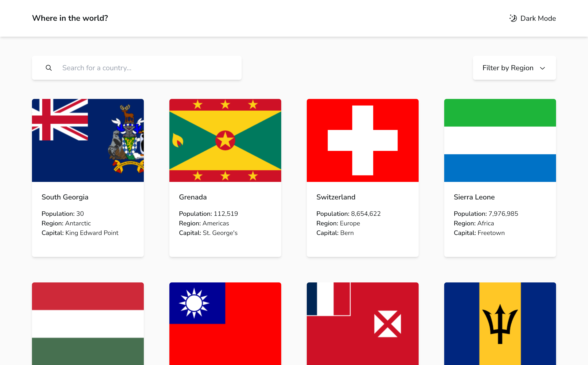

# Frontend Mentor - REST Countries API with color theme switcher solution

This is a solution to the [REST Countries API with color theme switcher challenge on Frontend Mentor](https://www.frontendmentor.io/challenges/rest-countries-api-with-color-theme-switcher-5cacc469fec04111f7b848ca). Frontend Mentor challenges help you improve your coding skills by building realistic projects.

## Table of contents

- [Overview](#overview)
  - [The challenge](#the-challenge)
  - [Screenshot](#screenshot)
  - [Links](#links)
- [My process](#my-process)
  - [Built with](#built-with)
  - [What I learned](#what-i-learned)
  - [Continued development](#continued-development)
  - [Useful resources](#useful-resources)
- [Author](#author)

## Overview

### The challenge

Users should be able to:

- See all countries from the API on the homepage
- Search for a country using an `input` field
- Filter countries by region
- Click on a country to see more detailed information on a separate page
- Click through to the border countries on the detail page
- Toggle the color scheme between light and dark mode _(optional)_

### Screenshot

### Links

- Solution URL: [Add solution URL here](https://your-solution-url.com)
- Live Site URL: [Add live site URL here](https://your-live-site-url.com)

## My process

I started out with building the site. Started with the home page. Styled the header, search, filters and the flag list. I implemented dark mode first because I know it would save me time later on. I built the functionality of the filter by region button. Then I styled the individual cards in the flag list. SInce im mapping the cards are reused for each country. Afterwards I used react router to set up routes to navigate to a specific country's page. Then Styled that page. I made the site Mobile first. After all the functionality of the site was completed with mobile I started styling with desktop.

### Built with

- Semantic HTML5 markup
- CSS custom properties
- Flexbox
- CSS Grid
- Mobile-first workflow
- TypeScript
- [React](https://reactjs.org/) - JS library
- [Vite](https://vitejs.dev/) - React framework -[React Router](https://reactrouter.com/en/main) - Page Routing
- [TailWind](https://styled-components.com/) - For styles -[TanStack Query](https://tanstack.com/query/latest) - For data fetching and handling

**Note: These are just examples. Delete this note and replace the list above with your own choices**

### What I learned

The two major learning are react router setup and tanstack query.

### Continued development

In future projects I want to continue to use Tanstack Query and react router. There's still some things I could improve on with styling with Tailwind such as adding animations. React router probably has more to offer which this project didn't really need to go into since it was pretty small as well as Tanstack query.

### Useful resources

- [Example resource 1](https://www.youtube.com/watch?v=MBlZ8Wzkbi4&t=2s&ab_channel=CosdenSolutions) - This helped me with using modern data fetching methods in React.
- [Example resource 2](https://www.youtube.com/watch?v=vIBKSmWAdIA&pp=ygUSdGFpbHdpbmQgZGFya21vZCBl) - This is video helped me reduce the amount of Tailwind style clutter by implementing a more efficient way to setup dark mode.

*

## Author

- Website - [Yash Ven](https://yashwanthvenkatesan.vercel.app/)
- Frontend Mentor - [@tigeryash](https://www.frontendmentor.io/profile/tigeryash)
